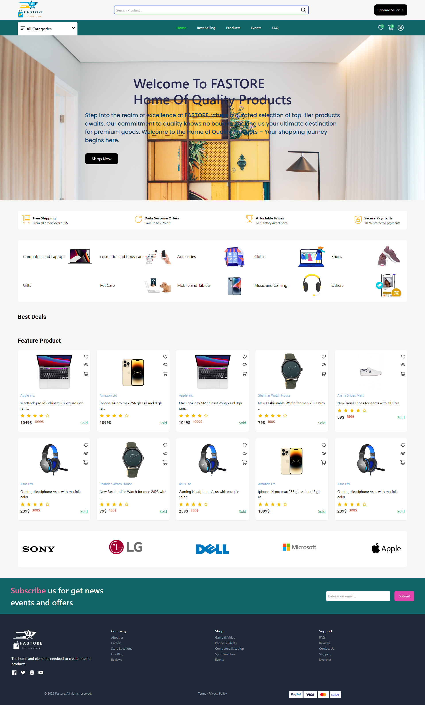

# Fastore - Multi-Vendor E-Commerce Web Application

Welcome to Fastore, a Multi-Vendor E-Commerce Web Application! This platform allows users to explore a wide range of products from different vendors, make purchases, and provides the ability for individuals to become sellers by registering their shops and listing their products for sale.



[Live Demo](https://fastore.onrender.com/)

## Getting Started

Follow these instructions to set up and run the project on your local machine.

### Prerequisites

Before you begin, ensure you have the following prerequisites installed:

- [Node.js](https://nodejs.org/) - Make sure you have Node.js installed.
- [npm](https://www.npmjs.com/) - npm is the package manager for JavaScript.

### Installation

1. Clone the repository to your local machine:

   ```shell
   git clone https://github.com/Zo3rb/Fastore
   ```

2. Navigate to the project directory:  
   `cd Fastore`
3. Copy and edit the `.env` file in the `./backend/config` folder by making a copy of `.env.example` and editing it with your specific configuration details.

### Running the Application

To start the application, navigate to the project root directory and run the following commands for each of the folders: `socket`, `backend`, and `frontend`.

1. Install project dependencies by running:

   `npm install --force`

2. Start the application by running:

   `npm run start`

3. Open your web browser and visit [http://localhost:3000](http://localhost:3000/) to access the Fastore Multi-Vendor E-Commerce Web Application.

## Usage

- Browse the platform and view products from various vendors.
- Make purchases by adding items to your cart and proceeding to checkout.
- Become a seller:
  - Register your shop by providing necessary information.
  - List your products for sale by adding product details, including name, description, price, and images.

## Contributing

We welcome contributions from the community. If you would like to contribute to the project, please follow these guidelines:

1. Fork the repository and clone it to your local machine.
2. Create a new branch for your feature or bug fix:

   shellCopy code

   `git checkout -b feature/my-feature`

3. Make your changes, commit them, and push to your forked repository.
4. Create a pull request with a clear description of your changes.

## License

This project is licensed under the MIT License - see the [LICENSE](https://chat.openai.com/c/LICENSE) file for details.

## Acknowledgments

We would like to thank the open-source community and all contributors for their support in building and improving the Fastore Multi-Vendor E-Commerce Web Application.

## Authors

Nwadike Joseph [jcyoung.mjc44@gmaIL.com](mailto:jcyoung.mjc44@gmaIL.com) 
Onyenuke chukwudi [onyenikechukwudi@gmaIL.com](mailto:onyenikechukwudi@gmaIL.com)
Emmanuel iwatt [iwattemma218@gmail.com](mailto:iwattemma218@gmail.com)
Ali Abu-elfottoh [ali.f90@outlook.com](mailto:ali.f90@outlook.com).

Happy shopping and selling! 🛒💼
